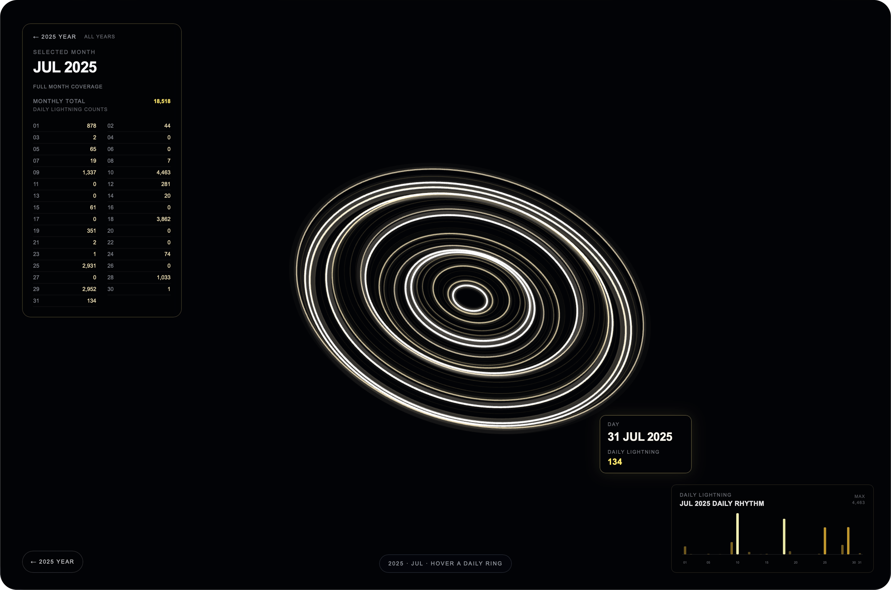
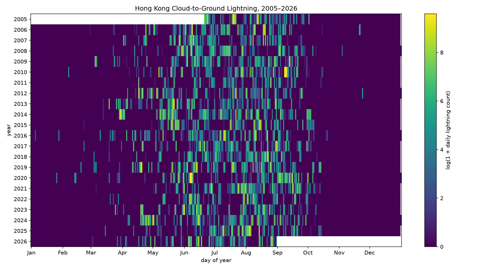
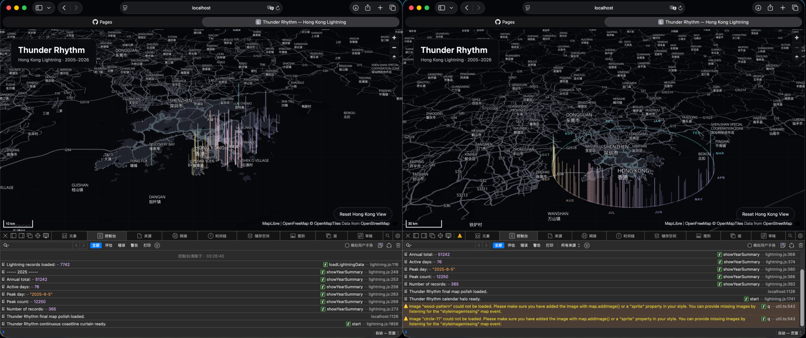
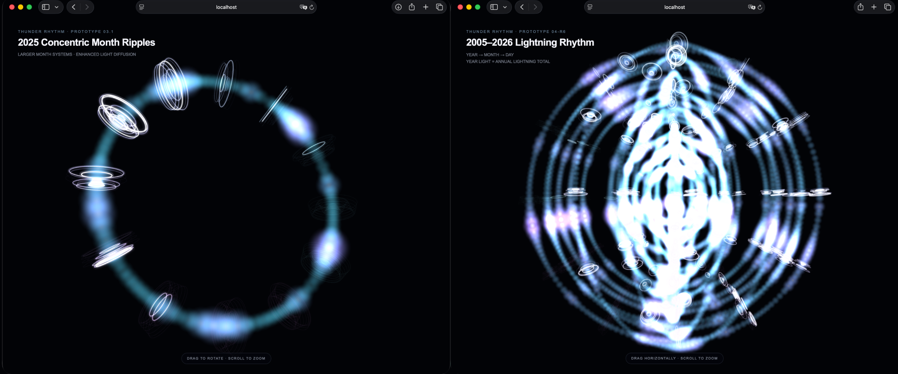

# Thunder Rhythm: Hong Kong Lightning Calendar

**Thunder Rhythm** is an interactive data visualisation based on open data from the Hong Kong Observatory. It explores how daily cloud-to-ground lightning activity changes over time across Hong Kong.

I chose lightning because it has a very noticeable rhythm, but not a completely regular one. Some periods are almost entirely quiet, while others suddenly contain highly concentrated bursts of activity.

At first, I was mainly interested in seasonal changes within a single year. As the project developed, I became more interested in comparing different years, months, and individual dates at the same time. I also wanted to find a way of showing these changes that felt more exploratory and visually engaging than a conventional statistical chart.

The main question I eventually arrived at was:

> **How can 22 years and 7,742 daily lightning records be read both as one long-term rhythm and as year, month, and day-level detail, without losing access to the exact values?**

---

## Interactive version

I built an interactive website for exploring the visualisation.

👉 **[Open the interactive version of Thunder Rhythm](https://vivienhh.github.io/hong-kong-lightning-calendar/)**

You can hover, click, drag, and scroll through three temporal levels:

**Year → Month → Day**


---

## The phenomenon

This project uses daily cloud-to-ground lightning records for the whole Hong Kong territory, covering the period from **2005 to 2026**.

At the beginning of the project, I mainly wanted to look at the seasonal pattern of lightning within one year. However, after testing different ways of showing the data, I realised that looking at only one year made it difficult to see longer-term differences. At the same time, putting more than twenty years of daily records into one image quickly became too crowded to read.

After several rounds of visual experiments and redesigns, I decided not to place all the data into one single view. Instead, I used **time scale** as the main structure and divided the visualisation into three levels:

**Year → Month → Day**

The first level compares changes across different years. Selecting a year opens its twelve months, and selecting a month makes it possible to inspect the individual daily records.

In the final system, I mainly worked with three parts of the data:

- **Time scale**: Year / Month / Day
- **Lightning count**: the recorded total for a day, month, or year
- **Data completeness**: complete / partial coverage / no data

Time determines the hierarchy and arrangement of the visualisation. Lightning count is mapped to thickness, brightness, and local light effects, while data completeness is used to distinguish complete records, partial coverage, and genuinely missing data.

---

## The source

The data comes from the Hong Kong Observatory open-data service:

[https://data.weather.gov.hk/weatherAPI/cis/csvfile/HK/ALL/daily_HK_LGTG_ALL.csv](https://data.weather.gov.hk/weatherAPI/cis/csvfile/HK/ALL/daily_HK_LGTG_ALL.csv)

The CSV file committed to this repository contains **7,742 daily records**. Each row includes:

- year
- month
- day
- daily cloud-to-ground lightning count
- a data completeness flag

The original CSV is stored in `data/`, so the project can still be run using the committed data without downloading it again.

The available records begin on **21 June 2005** and currently end on **31 August 2026**.

This means:

- **2005** begins on 21 June and therefore has partial coverage
- **2006–2025** contain complete yearly records
- **2026** currently ends on 31 August and therefore also has partial coverage

Because 2005 and 2026 are incomplete years, I do not treat them in exactly the same way as complete years. They are clearly marked as **partial coverage** in the visualisation.

I also distinguish between “no recorded data” and a genuine lightning count of zero, because these two situations do not mean the same thing.

---

## What the visualisation shows

### Level 1 — Year overview

The first level shows the overall temporal structure from **2005 to 2026**.

Each luminous ring represents one year. The rings are arranged chronologically around the same centre so that they form one continuous structure rather than a collection of separate charts.

At this level:

- **Radius** represents year and chronological order
- **Colour** gives each year its own identity
- **Thickness / Brightness** responds to the recorded annual lightning total
- Local changes in energy around the ring reflect monthly activity
- Brighter local flares indicate stronger daily lightning events

Hovering over a Year ring shows the corresponding year and lightning value. Clicking a year opens the second level, where its monthly data can be explored in more detail.

The bar chart in the lower-right corner provides a more direct comparison of annual totals. Hovering over a bar shows the year and its recorded lightning count.

The purpose of this level is to give a broad view of how lightning activity changes across more than twenty years, including when stronger activity becomes concentrated, before moving into the much denser daily records.

#### Why rings and light?

Visually, I did not want to treat the 22 years as completely separate charts. I wanted them to feel like parts of the same long-term record.

This is why I used rings arranged around a shared centre. Each year can still be recognised and compared on its own, but the whole structure also suggests continuity across time.

Lightning itself also made me think of something brief, concentrated, and energetic. Because of this, I did not rely only on conventional bars to represent lightning counts. Instead, I used **light** as a visual metaphor: higher values appear brighter and thicker and create stronger local light effects.

The brightness does **not** represent the physical brightness of real lightning. It is a visual encoding of the recorded lightning count.

From a distance, the 22 years form something like one large field of light created from the records. It can also be read as an abstract accumulation of more than twenty years of lightning activity over Hong Kong. When viewed more closely, the individual years, months, and daily changes become visible.

This relationship between **overall rhythm and local detail** later became the basis of the Year / Month / Day interaction.

---

### Level 2 — Year detail


Clicking a year opens the second level.

The selected Year is enlarged, while twelve Month structures are arranged around it.

Each Month contains a set of Daily rings, making it possible to first compare the overall differences between months within the selected year.

The selected year keeps the same colour identity it had in the overview. This helps maintain a visual connection between the two levels instead of making the detail view feel like a completely separate page.

Periods with stronger lightning activity appear brighter and thicker.

At this level, the bar chart in the lower-right corner changes to show **monthly lightning totals from January to December**.

Hovering over either a Month structure or its corresponding bar reveals the monthly value.

I use **2025** for the screenshot in this README because it contains a complete year of data and also shows clear differences between months, which makes this level easier to understand.

---

### Level 3 — Month detail



Clicking a month with available data opens the third level, the Daily view.

The screenshot in this README shows **July 2025**.

At this level, each concentric ring represents one calendar day.

**Day 01** starts from the inside, and later dates move outward in chronological order.

Depending on the actual number of days in the month, the Daily view contains **28–31 concentric rings**.

A day with more recorded lightning appears as a thicker and brighter ring, while quieter days are thinner and darker.

I chose slightly irregular, “breathing” rings rather than completely static and perfect circles because I wanted the changes in daily activity to feel more visible. The movement gives the structure a small sense of energy without changing the underlying order of the dates.

Because the days always move from the inside outward, it is also possible to compare activity in the beginning, middle, and end of a month.

The bar chart in the lower-right corner changes again at this level, showing daily lightning counts in chronological order.

Hovering over either a Daily ring or a bar reveals the exact date and recorded lightning count.

---

## What it shows — and what it hides

The visualisation makes three kinds of temporal pattern easier to see:

- long-term change across years
- seasonal concentration within a year
- sudden high-intensity events on particular days

However, the luminous rings are not a direct, proportional representation of the raw lightning counts.

Thickness, brightness, and glow are visually transformed so that extreme peaks do not completely overwhelm quieter periods. For exact values, the hover information and the corresponding bar charts should be used.

This is also why I decided not to rely only on the more expressive visual structure. I added quantitative bar charts at all three levels.

The luminous structures are mainly used to show rhythm and change, while the bars and hover values keep the exact numbers accessible.

The dataset also contains only **daily lightning totals for the whole Hong Kong territory**.

This means it can help answer:

> **“When was lightning activity higher in Hong Kong?”**

but it cannot answer:

> **“Where exactly in Hong Kong did the lightning occur?”**

Finally, records for 2005 begin only on 21 June, while the current 2026 data ends on 31 August. These two years are therefore marked as partial coverage and should not be interpreted in exactly the same way as the complete yearly records from 2006 to 2025.

---

## Design development

The final interactive visualisation was not decided from the beginning. It developed through a series of data checks, visual experiments, and ideas that did not work as expected.

### 1. Inspecting the data

I started with a simple plot to check the downloaded dataset.

At this stage, I was not trying to design the final visualisation. I first needed to confirm:

- whether the CSV could be read correctly
- whether the values were still being treated as strings
- whether the number of records was correct
- the minimum and maximum values
- whether there were unusually large peaks
- the actual date coverage of the dataset

This helped me understand the basic structure of the data. It also showed that the lightning counts vary a lot: most days are relatively quiet, while a small number of days contain very large peaks.

That difference became important in almost every later design decision.

### 2. Raw heatmap and logarithmic heatmap

I then made both a **raw heatmap** and a **logarithmic heatmap** to see how different transformations changed the pattern that became visible.


*Raw heatmap using the original lightning counts.*



*Logarithmic heatmap. Compressing the extreme values made medium-intensity activity easier to see.*

The raw heatmap stays closer to the original numerical differences, but the largest values quickly dominate the image, making many medium- and low-intensity days difficult to distinguish.

The logarithmic heatmap compresses those extreme differences and makes more of the medium-intensity activity visible.

This experiment made me realise that:

> A data visualisation is not simply a matter of “drawing the numbers”. The transformation itself changes what the viewer is able to see.

This issue continued into the final version, which is why I kept exact hover values and bar charts instead of allowing the visual transformation to completely replace the original quantities.

### 3. The map approach — and why I abandoned it

Because the data comes from Hong Kong, my first instinct was to make the shape of Hong Kong an important part of the visualisation.

I experimented with arranging daily bars around the Hong Kong boundary, using colour to distinguish different periods and trying to organise the records spatially.



*Early map-based experiment. I initially tried to organise the daily records around the Hong Kong boundary, but the result became visually crowded and suggested a spatial dimension that the dataset does not actually contain.*

The idea quickly created several problems.

First, more than 7,000 daily records became extremely crowded in a limited space.

Second, Hong Kong has a complicated and fragmented coastline. Once large amounts of data were placed around it, the geographic shape became more distracting than helpful.

More importantly, I eventually realised:

> **The dataset does not contain the coordinates of individual lightning events.**

It records the total daily lightning count across Hong Kong, rather than showing where each lightning event occurred within Hong Kong.

This meant that although the map gave the work a recognisable local identity, it was not actually encoding a spatial dimension from the dataset. It was mostly acting as decoration.

This failed direction taught me that **a geographically recognisable shape is not automatically a meaningful way to represent geographical data**.

After this, I began removing spatial elements that were not directly supported by the dataset and focused on the two variables that actually mattered:

**time + lightning count**

This made the later design process much clearer.

### 4. The 2025 radial calendar

After that, I developed a **2025 radial calendar**.



*2025 radial calendar prototype. This version made the seasonal pattern within one year visible, but it did not scale well when I tried to compare more than one year.*

In this version, each day of the year was positioned around a circle, while the daily lightning count controlled the length of the radial bar.

This made the seasonal pattern within 2025 much easier to see and was also my first serious attempt to represent time through a circular structure.

However, it still worked best for only one year.

If I placed all years from 2005 to 2026 into the same radial calendar, the different years quickly overlapped and became difficult to compare.

At that point, I realised that the main problem was no longer:

> **“How can I make a better radial chart?”**

Instead, it became:

> **“How should different time scales be organised?”**

### 5. From one picture to three temporal levels

I therefore stopped trying to fit more and more data into one static image.

Instead, I split the information into three temporal levels:

**Year → Month → Day**

The viewer first sees the long-term yearly structure.

If they become interested in a particular year, they can open its monthly view.

If they then choose a month, they can move into the daily records.

This reduces the amount of information shown at one time and makes comparisons at different scales easier to follow.

### 6. Interaction and visual references

After deciding on the **Year → Month → Day** structure, I looked at several interactive and generative visual examples on OpenProcessing.

I was particularly interested in:

- particle movement
- orbital structures
- glow effects
- local fluctuation
- mouse hover
- click-based state changes
- continuous animation

I did not use these examples as direct templates for the final visualisation. Instead, they helped me understand how dynamic visual systems can be organised in the browser and how a continuously running visual can respond to user input.

I then reworked these interaction ideas around my own lightning dataset. The data mapping, interaction states, and visual hierarchy were redesigned for the Year, Month, and Day levels, gradually developing into the current system.

The development process, including the code experiments and AI-assisted iterations, is documented in [`PROCESS.md`](PROCESS.md).

### 7. Balancing expressive and quantitative visualisation

As the visual style became more abstract, I ran into another problem.

If I kept only the glowing particles and ring structures, the overall rhythm was visible, but exact values became difficult to read quickly.

For this reason, I did not let the expressive visual layer completely replace conventional charts. I kept both.

The luminous structures are mainly used for:

- overall rhythm
- differences in intensity
- temporal hierarchy
- visual exploration

The bar charts and hover information are mainly used for:

- exact values
- direct comparison between years, months, and days
- checking the values behind the visual encoding

The final design therefore supports two ways of reading the same data:

> **First notice the overall change, then inspect the exact numbers.**

---

## Interaction

The visualisation is mainly explored with the mouse.

### Hover

Hovering over a Year, Month, or Daily ring reveals the corresponding time and lightning value.

The bar charts in the lower-right corner of all three levels also support hover, so the yearly, monthly, or daily values can be read directly.

### Click

Clicking a Year opens the Month level.

Clicking a Month with available data opens the Daily level.

Months without records are not treated as zero and do not open a daily view that does not exist.

### Drag

In the Overview and Year views, the visual structure can be rotated by dragging.

### Scroll

In the Overview, the scroll wheel can be used to adjust the viewing distance.

### Navigation

The Month view can return to its selected Year, and the Year view can return to the full Overview.

### Transition

I added a short fade-to-black and fade-in transition when moving between temporal levels.

This does not change the data. It is simply a navigation cue that helps the user feel that they are moving from one time scale into another, rather than suddenly jumping to a completely unrelated page.

---

## Run it

Fetch and inspect the data:

```bash
uv run fetch.py
uv run plot.py
```

To view the interactive version locally:

```bash
python3 -m http.server 8001
```

Then open:

```text
http://localhost:8001/web/
```

The published interactive version is also available here:

[https://vivienhh.github.io/hong-kong-lightning-calendar/](https://vivienhh.github.io/hong-kong-lightning-calendar/)

---

## Data coverage

The visualisation currently uses:

- **2005:** partial coverage from 21 June
- **2006–2025:** complete yearly coverage
- **2026:** partial coverage through 31 August

The dataset represents the **daily cloud-to-ground lightning total across the whole Hong Kong territory**.

This project focuses on temporal change. It does not use district-level data or coordinates for individual lightning events, so the visualisation should not be interpreted as showing the spatial distribution of lightning within Hong Kong.